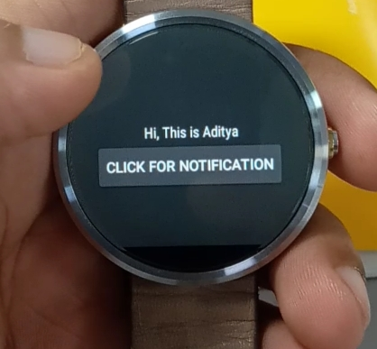
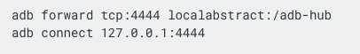

# Android_SmartWatch_SimpleAPP
This is android Smart watch simple application and debug and compile in ANDROID STUDIO.
 

Steps: 
1. Clone the project and open it in android studio.

2. Put your smart watch in bluetooth debugging mode via developer mode in setting

3. Download the google Wear OS in your android mobile, which will communicate between host
https://developer.android.com/training/wearables/apps/debugging

4. Connect your smart watch to ur Target (Smart Watch). 

5. Then connect your mobile to PC having android studio which will work as a HOST. 

6. Type the following command in the terminal of Android Studio as shown in the pic or Follow the instruction of this link: "https://developer.android.com/training/wearables/apps/debugging"
 

7. Now once your android studio shows the connection to your android smart watch.. RUN the code. 

